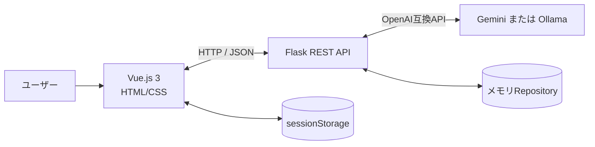
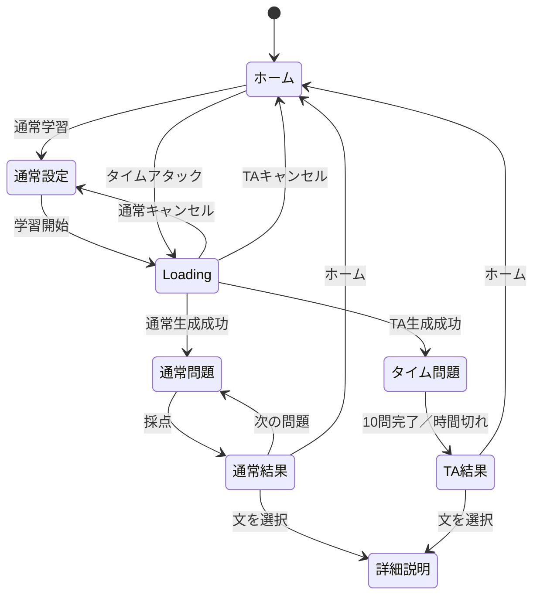
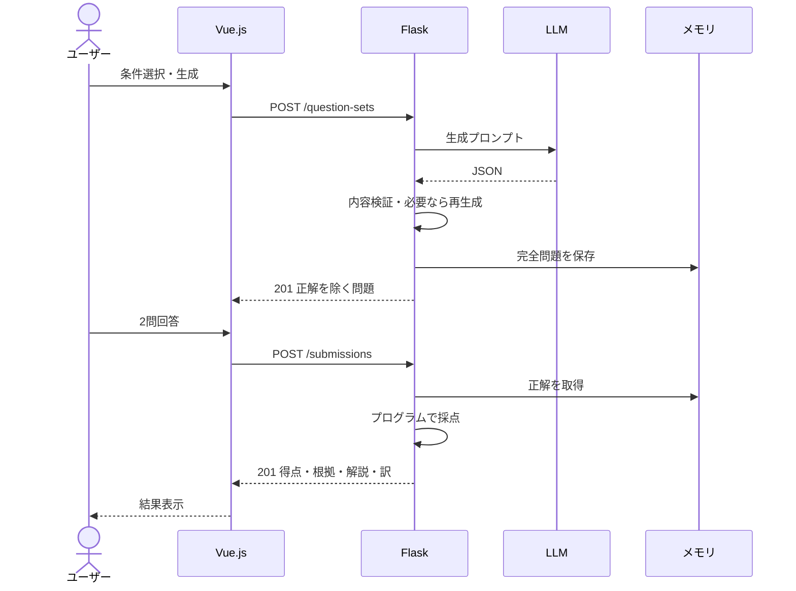
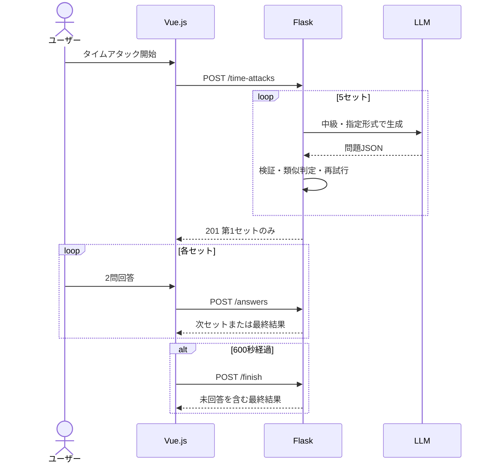
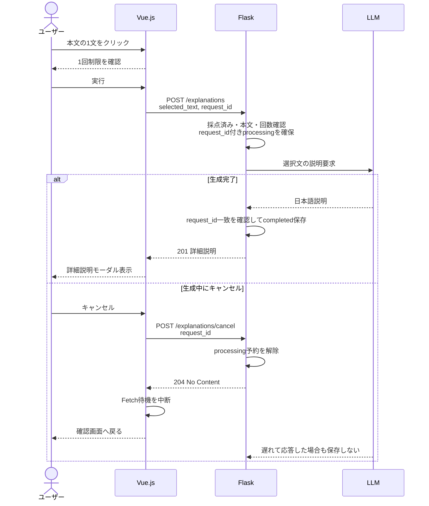
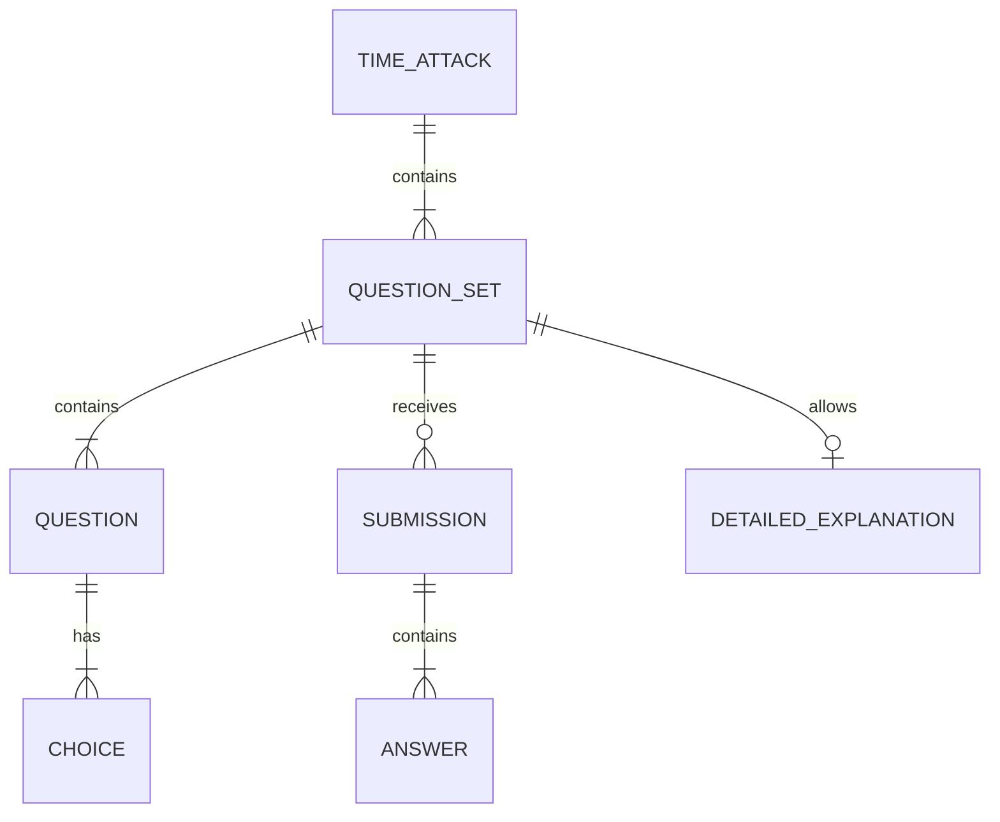

# English Reading Quest 要件定義書・基本設計書

# 第I部 要件定義書

## 1. システム名とキャッチコピー

### 1.1 システム名

**English Reading Quest**

旧文書内の「AI English Reading Trainer」「英語長文問題作成アプリ」「英語長文トレーニング」という呼称は、本書では **English Reading Quest** に統一する。

### 1.2 キャッチコピー

**Never Run Out of TOEIC.**

難易度と文章形式を選ぶだけで、AIが作る新しいPart 7形式の英文をすぐに解き、根拠まで復習できる。

### 1.3 システム概要

English Reading Questは、生成AIを利用してTOEIC Part 7形式を参考にしたオリジナルの英語読解問題を生成するPC向けWebアプリである。

通常学習では、ユーザーが難易度と文章形式を選択し、英語長文1つと4択問題2問に回答する。採点後は、得点、正誤、正解、本文中の根拠、日本語解説、全文の日本語訳を確認できる。さらに、本文中の気になる1文を選択し、文法構造・語句・フレーズの詳細説明をAIから1回だけ取得できる。詳細説明は生成に成功した時点で利用済みとし、生成中にキャンセルまたは生成に失敗した場合は再度利用できる。

タイムアタックでは、中級の問題を2問ずつ5セット、合計10問出題する。制限時間は10分であり、メール・お知らせ・広告・記事を組み合わせて出題する。時間切れの場合は未回答を不正解として採点し、終了後にセット単位で問題・回答・解説を復習できる。

本システムは実在するTOEIC問題を保存・複製せず、LLMが生成したオリジナル問題のみを扱う。

## 2. ターゲットユーザーと解決したい課題

### 2.1 ペルソナ

| 項目 | 内容 |

| --- | --- |

| 氏名 | 英語 学（架空） |

| 年齢・職業 | 20歳・情報系学部の大学生 |

| 英語レベル | TOEIC 450～550点程度 |

| 目標 | TOEIC 700点以上、留学や就職に向けた読解力向上 |

| 利用場面 | 授業の空き時間、休み時間、帰宅後など |

| 1回の学習時間 | 通常学習は数分、タイムアタックは10分程度 |

| 利用環境 | Windows 10／11のPC、ChromeまたはEdge |

| ITスキル | 一般的なWebサービスを操作できる |

| 主なニーズ | 教材を探さず開始し、正誤だけでなく根拠まで短時間で理解したい |

### 2.2 解決したい課題

- 自分の英語力に合う長文問題を探すまでに時間がかかる。

- 市販教材は問題数に限りがあり、反復すると答えを記憶してしまう。

- 不正解時に、なぜ間違えたか、本文のどこを読めばよかったかが分かりにくい。

- 長文全体の訳は確認できても、個別の文法構造やフレーズをすぐ質問できない。

- 短い休み時間では、教材選択から学習開始までの準備が負担になる。

- 本番を意識して複数の長文を時間内に解く練習がしにくい。

## 3. As-IsとTo-Be

### 3.1 As-Is

- 学習者が教材、難易度、問題形式を自分で探す必要がある。

- 同一教材を繰り返すと、読解ではなく記憶で解けるようになる。

- 根拠と解説が別ページにあり、本文と照合しにくい場合がある。

- 気になる一文の文法を調べるには、別の辞書やAIサービスへ移動する必要がある。

- 短時間学習と本番形式の時間練習を同じサービスで切り替えにくい。

- 学習を始めるまでの手順が多く、継続の妨げになる。

### 3.2 To-Be

- 通常学習またはタイムアタックをホーム画面から選び、すぐに開始できる。

- 初級・中級・上級と4つの文章形式から目的に合う条件を選べる。

- 毎回異なるオリジナル問題を生成し、答えの暗記に依存せず練習できる。

- 採点後、本文を残したまま正解・根拠・日本語解説・全文訳を確認できる。

- 根拠文が色分けされ、本文と解説を往復しやすい。

- 気になる一文をクリックし、確認操作の後に詳細説明を取得できる。

- 10分間で5パッセージ・10問を解くタイムアタックに挑戦できる。

- 同じタブを開いている間は回答数・正答率・ランク進捗を確認できる。

## 4. 機能要件

### 4.1 通常学習

| ID | 要件 | 優先度 |

| --- | --- | --- |

| FR-01 | ユーザーは通常学習とタイムアタックを選択できること | Must |

| FR-02 | 通常学習では初級・中級・上級を選択できること | Must |

| FR-03 | 通常学習ではメール・お知らせ・広告・記事を選択できること | Must |

| FR-04 | 選択条件から英文1つ、設問2問、各4択を生成できること | Must |

| FR-05 | 各設問について選択肢を1つだけ選べること | Must |

| FR-06 | 2問すべてに回答するまで採点せず、未回答を通知できること | Must |

| FR-07 | 採点結果として2点満点の得点と設問ごとの正誤を表示できること | Must |

| FR-08 | 採点後に正解、根拠、日本語解説を表示できること | Must |

| FR-09 | 採点後に英文全体の日本語訳を開閉できること | Must |

| FR-10 | 本文中の根拠文を設問別に色分けして表示できること | Must |

| FR-11 | 通常学習の経過時間と目安時間3分を表示できること | Should |

| FR-12 | 採点後に不正解の問題だけへ表示を絞れること | Should |

| FR-13 | 採点後に次の問題を生成できること | Must |

### 4.2 詳細説明

| ID | 要件 | 優先度 |

| --- | --- | --- |

| FR-14 | 採点後、本文中の1文を選択して詳細説明を要求できること | Must |

| FR-15 | 初回要求前に、1回制限をユーザーへ確認すること | Must |

| FR-16 | 詳細説明には自然な日本語訳、文法構造、重要語句・表現を含めること | Must |

| FR-17 | 詳細説明の新規生成は1パッセージにつき1回に制限すること | Must |

| FR-18 | 取得済みの詳細説明は、同じ文を再クリックして再表示できること | Must |

| FR-19 | AI通信に失敗した場合、または生成中にキャンセルした場合は利用回数を消費せず再試行できること | Must |

### 4.3 タイムアタック

| ID | 要件 | 優先度 |

| --- | --- | --- |

| FR-20 | 中級の2問セットを5つ、合計10問生成できること | Must |

| FR-21 | 4文章形式を1回ずつ含め、5セット目は対応形式からランダムに選ぶこと | Must |

| FR-22 | 制限時間を10分とし、残り時間を表示すること | Must |

| FR-23 | 回答済みセットへ戻り、回答を確認・変更できること | Must |

| FR-24 | 未表示の問題セットへ直接回答できないこと | Must |

| FR-25 | 時間切れ時は回答済みデータを送信し、未回答を不正解として採点すること | Must |

| FR-26 | 全10問の得点と、セット別の問題・回答・根拠・解説・日本語訳を表示できること | Must |

| FR-27 | 結果画面を前へ・次へで1パッセージずつ復習できること | Must |

| FR-28 | タイムアタックでも各パッセージにつき詳細説明を1回利用できること | Must |

### 4.4 学習進捗・画面操作

| ID | 要件 | 優先度 |

| --- | --- | --- |

| FR-29 | 同じブラウザタブ内で累計回答数と正答率を保持できること | Should |

| FR-30 | セッション中の正解数からランクと次ランクまでの進捗を表示できること | Should |

| FR-31 | ランクをウォーミングアップ、ブロンズ、シルバー、ゴールドの4段階とすること | Should |

| FR-32 | 通常学習でゴールドへ初到達後、次の画面移動時に祝福モーダルを表示すること | Could |

| FR-33 | ホームにABOUT、MODES、FEATURES、HOW TO PLAYを表示し、メニューから移動できること | Should |

| FR-34 | 問題生成中は画面全体を、詳細説明生成中は確認モーダル内をぼかし、対象範囲の他の操作を抑止してLoadingとキャンセルを表示すること | Must |

| FR-35 | キャンセル時は完了通知を出さず、通常学習は設定画面、タイムアタックはホームへ戻ること。詳細説明は確認画面へ戻り、再度生成できること | Should |

### 4.5 バックエンド品質・安全性

| ID | 要件 | 優先度 |

| --- | --- | --- |

| FR-36 | LLM出力が仕様違反の場合、検証理由を次の生成指示へ加えて最大3回再生成すること | Must |

| FR-37 | タイムアタックの各セット生成失敗時、成功済みセットを保持して対象セットを最大3回再試行すること | Must |

| FR-38 | 問題生成時に正解・根拠・解説をブラウザへ返さないこと | Must |

| FR-39 | 採点は保存済み正解を使う通常処理とし、LLMを呼ばないこと | Must |

| FR-40 | API入力の型、項目名、許可値、件数、重複を検証すること | Must |

| FR-41 | 同一IPからの短時間の過剰アクセスを制限すること | Must |

| FR-42 | 同時リクエストによるタイムアタック状態の二重更新を防ぐこと | Must |

| FR-43 | 有効期限切れのメモリデータを定期的に削除すること | Must |

## 5. 主要な受入条件

- ホームから通常学習とタイムアタックを開始できる。

- 通常学習では3難易度と4文章形式を選択できる。

- 問題生成後、英文1つ、設問2問、各設問4つの選択肢が表示される。

- 英文はバックエンド検証上130～200語であり、生成指示上は150～180語を目標とする。

- 採点前に正解、根拠、解説、日本語訳を公開しない。

- 2問すべてに回答した場合のみ通常採点できる。

- 採点後に得点、正誤、正解、根拠、日本語解説、全文訳を確認できる。

- 詳細説明は各パッセージで生成成功1回、取得済み内容の再表示は可能である。生成失敗または生成中のキャンセルでは回数を消費せず、再試行できる。

- タイムアタックは中級、5パッセージ、10問、制限時間600秒で動作する。

- 時間切れ後は未回答を不正解として結果を表示する。

- LLMの通信失敗や出力不正時もFlask全体が停止せず、日本語エラーと再試行手段が表示される。

- APIキー、Authorizationヘッダー、内部例外をユーザー画面に表示しない。

## 6. 非機能要件

| ID | 分類 | 要件 | 優先度 |

| --- | --- | --- | --- |

| NFR-01 | 性能 | Geminiによる通常問題生成は原則60秒以内を目標とする | Must |

| NFR-02 | 性能 | Ollama利用時はPC性能を考慮し、クライアントタイムアウトを180秒とする | Must |

| NFR-03 | 性能 | 採点バックエンド処理は1秒以内とする | Must |

| NFR-04 | 性能 | 詳細説明は学習を妨げない実用的な時間で返す | Should |

| NFR-05 | 可用性 | LLM障害時もアプリ全体を停止せず再試行できる | Must |

| NFR-06 | セキュリティ | APIキーをソース、フロントエンド、Gitへ保存しない | Must |

| NFR-07 | セキュリティ | APIキーとプロバイダー選択を環境変数で管理する | Must |

| NFR-08 | セキュリティ | 同一IPにつき全APIは60回／分、LLM利用APIは10回／分に制限する | Must |

| NFR-09 | セキュリティ | ログへAPIキー、Authorizationヘッダー、プロンプト全文を出力しない | Must |

| NFR-10 | 整合性 | 共有メモリ更新をロックで保護し、詳細説明はrequest_idで生成・キャンセルの競合を防ぐ | Must |

| NFR-11 | 保守性 | GeminiとOllamaの差異をバックエンド内部で吸収する | Must |

| NFR-12 | 保守性 | APIレスポンスのキーをlower_snake_caseへ統一する | Must |

| NFR-13 | 対応環境 | Windows 10／11、最新版Chrome・Edgeを主要環境とする | Must |

| NFR-14 | 実行環境 | Python 3.11～3.13およびFlaskで動作する | Must |

| NFR-15 | データ | DBを使用せず、サーバーメモリとsessionStorageだけを使用する | Must |

| NFR-16 | 開発運用 | Markdown、Git、GitHubを用い、設計書とコードの差分を管理する | Must |

| NFR-17 | デバッグ | 提出版はFLASK_DEBUG=falseを既定とする | Must |

### 6.1 実測結果

| 処理 | 実測 |

| --- | ---: |

| 通常問題生成 | 6.42秒 |

| 詳細説明生成 | 4.03秒 |

| 採点バックエンド平均 | 1.264ミリ秒 |

| PowerShellのHTTP処理を含む採点参考値 | 2.045秒 |

タイムアタック開始時間は、`{"level":"intermediate"}`を送信し、5セット・10問の生成成功を確認した計測値を記録する。空JSONで422となった時間は生成時間に含めない。

## 7. 使用技術

| 分類 | 技術・ライブラリ |

| --- | --- |

| フロントエンド | Vue.js 3、HTML5、CSS3、Bootstrap 5 |

| バックエンド | Python、Flask |

| HTTPクライアント | Fetch API |

| 通信 | REST、HTTP、JSON、UTF-8 |

| LLMクライアント | OpenAI Python SDKの互換インターフェース |

| クラウドLLM | Gemini OpenAI互換エンドポイント |

| ローカルLLM | Ollama OpenAI互換エンドポイント |

| 設定管理 | .env、python-dotenv |

| 一時保存 | Python辞書、ブラウザsessionStorage |

| バージョン管理 | Git、GitHub |

| API記述 | OpenAPI 3.0.3 |

## 8. MVPと今回の設計範囲

### 8.1 MVPの定義

本プロジェクトにおけるMVPは、ユーザーが難易度を選択し、AIが生成したTOEIC Part 7形式の問題に回答して、採点結果と解説を確認するまでの最小限の学習サイクルとする。

| ID | MVPに含める機能 | 完了条件 | 対応要件 |

| --- | --- | --- | --- |

| MVP-01 | 難易度選択 | 初級・中級・上級から1つ選択できる | FR-02 |

| MVP-02 | 問題生成 | 英文1つ、設問2問、各4択を生成できる | FR-04 |

| MVP-03 | 回答操作 | 各設問で1つを選択し、未回答時は警告できる | FR-05、FR-06 |

| MVP-04 | 自動採点 | 2問分の得点と設問ごとの正誤を返せる | FR-07、FR-39 |

| MVP-05 | 解説表示 | 正解、本文中の根拠、日本語解説を採点後に表示できる | FR-08、FR-38 |

| MVP-06 | 基本状態表示 | Empty、Loading、Normal、Errorを同一画面で扱える | FR-34 |

| MVP-07 | 基本的な異常処理 | 入力不正、LLM通信失敗、出力不正時にアプリを停止せず通知できる | FR-36、FR-40 |

MVPの中心は「選ぶ、生成する、解く、採点する、復習する」の5段階である。MVPだけでも英語読解学習アプリとして一連の操作を完結できることを成立条件とする。

### 8.2 MVP完成後に追加し、今回の設計・実装に含める機能

次の機能はMVPの成立に必須ではないが、開発期間内に実装したため、今回の完成版および本設計書の対象に含める。

| 分類 | 今回追加した機能 | 対応要件 |

| --- | --- | --- |

| 出題範囲 | メール・お知らせ・広告・記事、上級難易度 | FR-02、FR-03 |

| 復習支援 | 全文日本語訳、根拠ハイライト、不正解のみ表示 | FR-09、FR-10、FR-12 |

| 詳細学習 | 選択した1文の訳・文法・重要表現の詳細説明 | FR-14～FR-19 |

| 連続演習 | 中級5パッセージ・10問・10分のタイムアタック | FR-20～FR-28 |

| 学習進捗 | 累計回答数、正答率、4段階ランク、到達演出 | FR-29～FR-32 |

| UI | ホーム案内、モード説明、全画面Loading、キャンセル | FR-33～FR-35 |

| 品質 | 出力検証、再生成、類似検出、LLM切り替え | FR-36～FR-40 |

| 安全性 | レート制限、排他制御、古いメモリデータの削除 | FR-41～FR-43 |

したがって、今回の完成版の実装範囲は次のとおりである。

- TOEIC Part 7を参考にした単一文書形式

- 初級・中級・上級

- メール・お知らせ・広告・記事

- 通常学習、タイムアタック

- 自動採点、根拠、日本語解説、全文訳

- 1文の詳細説明

- 根拠ハイライト、不正解のみ表示

- セッション内進捗、4段階ランク、ゴールド到達演出

- LLM切替、出力検証、再生成、重複検出

- レート制限、同時更新保護、有効期限削除

### 8.3 今回の設計・実装対象から外す機能

次の機能は将来構想として検討可能だが、9日間・2人で完成させる今回の範囲には含めない。本書のAPI、画面、データ設計およびテスト仕様でも実現を保証しない。

| 対象外機能 | 今回外す理由 | 将来追加時に必要となる主な変更 |

| --- | --- | --- |

| ユーザー登録・ログイン・権限管理 | 個人の短時間学習に必須ではなく、認証設計が大きい | Userデータ、認証API、パスワードまたは外部認証、認可処理 |

| DBへの問題・履歴・成績の永続保存 | 今回はサーバーメモリとsessionStorageで要件を満たせる | SQLite／MySQL、Repository実装、マイグレーション、バックアップ |

| 複数端末間の履歴共有 | 認証とDBが前提になる | ユーザーIDに紐づく履歴APIと同期処理 |

| 全利用者ランキング | DB、本人識別、不正対策が必要になる | ランキングテーブル、集計API、表示名管理、不正スコア対策 |

| 復習リスト・長期的な苦手分析 | 長期履歴を保存しない方針と合わない | 回答履歴の永続化、分析処理、復習画面 |

| TOEIC Part 1～6 | 問題構造と必要メディアがPart 7と異なる | Part別スキーマ、API、プロンプト、画面、採点処理 |

| 複数文書形式のPart 7 | 文書間の関係と設問数が現行モデルと異なる | 複数passage対応のデータ構造、生成・表示・検証処理 |

| 音声認識・音声読み上げ | 音声ファイル生成・配信・再生設計が必要になる | 音声API、ファイル保存、プレイヤー、対応ブラウザ検証 |

| 公式TOEIC問題の収録 | 著作権上、独自生成問題を扱う方針とする | 使用許諾およびコンテンツ管理 |

| SNS共有・決済・管理者画面 | 学習の中核機能ではなく開発期間を超える | 外部API、権限、課金・運用設計 |

| ブラウザ終了後も残るランク・履歴 | 休み時間単位の一時的な利用を想定している | localStorageまたはDB。ただし改ざん対策にはサーバー保存が必要 |

対象外機能は、現行機能の未完成部分ではなく、今回の合格条件に含めない将来候補として扱う。追加する場合は、要件変更としてAPI、画面、データ構造、セキュリティおよびテストへの影響を再評価する。

## 9. 前提条件・制約

- 開発期間は9日間、開発者は2名とする。

- PCブラウザを主要利用環境とし、スマートフォンは最低限の表示対応に留める。

- Gemini利用時はインターネット接続と有効なAPIキーが必要である。

- Ollama利用時はローカルでOllamaが起動し、指定モデルが導入済みである必要がある。

- Geminiの無料枠、モデル提供状況、利用上限は外部サービスに依存する。

- Ollamaの速度と品質はPC性能およびモデルサイズに依存する。

- サーバー再起動時にバックエンドの問題・回答・タイムアタック・詳細説明は消える。

- タブを閉じるとsessionStorage上の進捗とランクは消える。

- フロントの生成キャンセルはHTTP要求の待機を中止するが、送信済みのLLM処理自体がプロバイダー側で直ちに停止するとは限らない。詳細説明ではキャンセルAPIによってサーバー側の生成予約も解除し、後から返ったキャンセル済み結果は保存しない。

## 10. 用語

| 用語 | 定義 |

| --- | --- |

| 問題セット | 英文1つと、その英文に基づく設問2問の組 |

| パッセージ | LLMが生成した英語長文 |

| 提出 | 問題セットに対する2問分の回答と採点結果 |

| 詳細説明 | 選択した1文についてAIが生成する訳・文法・重要表現の説明 |

| タイムアタック | 中級5パッセージ・10問を10分で解くモード |

| Repository | DBではなく、Flaskプロセス内のPython辞書による一時保存領域 |

| 今回の学習ランク | 同じタブを開いている間の正解数に応じた表示 |

## 11. 変更管理

- 本書の変更はソースコードと同じGitリポジトリで管理する。

- 要件変更時は目的、優先度、工数、API、画面、テストへの影響を確認する。

- 実装と文書が異なる場合は、動作確認済みの実装を根拠に本書を更新する。

- 追加機能で納期または品質が損なわれる場合は、スコープ外として次期版へ送る。

---

# 第II部 基本設計書

## 1. 設計方針

### 1.1 目的

短時間で問題生成から回答、採点、根拠確認、詳細学習まで完結させる。フロントエンドは学習体験と状態表示を担当し、バックエンドは秘密情報、正解、LLM通信、検証、採点、利用回数制限を担当する。

### 1.2 主要な設計判断

| 判断 | 理由 |

| --- | --- |

| SPA風の1ページ構成 | ページ読込を挟まず短時間で学習できるため |

| 正解をバックエンドだけに保存 | 採点前の答えの露出を避けるため |

| 採点でLLMを呼ばない | 高速かつ決定的に採点するため |

| Gemini／Ollamaを環境変数で切替 | チーム内のAPI利用可否やPC環境差を吸収するため |

| DBを使用しない | 9日間の演習範囲とMVPを優先するため |

| sessionStorageを使用 | 休み時間単位の短期進捗に限定し、長期保存を要求しないため |

| 詳細説明を1パッセージ1回に制限 | AI利用量を抑えながら深掘りを提供するため |

| タイムアタックを開始時に5セット生成 | 各セット間でLoadingを繰り返さないため |

## 2. システム構成



| 構成要素 | 役割 |

| --- | --- |

| ブラウザ | モード選択、表示、回答、タイマー、復習、進捗表示 |

| Vue.js | 画面状態、Fetch通信、回答データ、モーダル、タイマーを管理 |

| Flask | API、入力検証、LLM通信、出力検証、採点、状態管理 |

| LLM | 英文、全文訳、設問、選択肢、正解、根拠、解説、詳細説明を生成 |

| メモリRepository | 完全な問題、提出、タイムアタック、詳細説明を一時保存 |

| sessionStorage | 同一タブ内の回答数、正答率、ランク用正解数を保存 |

フロントエンドからGeminiやOllamaを直接呼ばない。LLMの種類、モデル名、APIキーはバックエンドだけが知る。

## 3. 画面構成・画面遷移

### 3.1 画面一覧

| 画面・状態 | 主な内容 |

| --- | --- |

| ホーム | タイトル、通常学習、タイムアタック、進捗、説明コンテンツ |

| 通常学習設定 | 難易度3種、文章形式4種、開始ボタン |

| Loading | ぼかし、スピナー、キャンセル |

| 通常問題 | 英文、2問、4択、経過時間 |

| 通常結果 | 得点、根拠、解説、全文訳、詳細説明、不正解絞り込み |

| タイムアタック問題 | セット位置、残り時間、英文、2問、前へ・次へ |

| タイムアタック結果 | ゲームオーバー表示、総得点、セット別復習 |

| 詳細説明確認 | 1回制限の確認、右上の×、生成開始ボタン |

| 詳細説明Loading | 確認モーダル内のぼかし、Loading、生成中メッセージ、キャンセル |

| 詳細説明モーダル | 選択文とAI説明 |

| ゴールド祝福 | 最高ランク到達を通知するモーダル |

| エラー | 状況別日本語メッセージと必要に応じた再試行 |

### 3.2 画面遷移



### 3.3 ホーム画面

- 左上にハンバーガーメニューを表示する。

- メニュー項目はABOUT、MODES、FEATURES、HOW TO PLAYとする。

- 右上に今回のランク、次ランクまでの正解数、円形進捗、正答率を常時表示する。

- ファーストビューは「NEVER RUN OUT OF TOEIC」「English Reading Quest」と2つのモードボタンを中心に配置する。

- ABOUT以降はスクロール位置に応じて表示アニメーションを繰り返す。

### 3.4 ランク

| ランク | セッション内正解数 |

| --- | ---: |

| ウォーミングアップ | 0～2 |

| ブロンズ | 3～5 |

| シルバー | 6～9 |

| ゴールド | 10以上 |

円形表示は正答率ではなく、次のランクまでの正解数の進捗を示す。正答率は文字で別表示する。未回答時の正答率は「―」とする。

### 3.5 Loadingとキャンセル

- 通常問題およびタイムアタックの生成中は、画面全体を半透明でぼかす。

- スピナー、Loading表示、キャンセルボタンを出す。

- 他の画面操作を抑止する。

- `AbortController`でフロント側のFetch待機を中断する。

- 通常生成のキャンセル後は設定画面へ、タイムアタックのキャンセル後はホームへ戻る。

- 詳細説明の確認画面では右上の×だけで確認を取り消し、右下に重複するキャンセルボタンは置かない。

- 詳細説明生成中は確認モーダル内だけをぼかし、中央に白いLoading表示、生成中メッセージ、キャンセルボタンを表示する。

- 詳細説明生成中のキャンセルでは、キャンセルAPIを送信してサーバー側のprocessing予約を解除してからFetch待機を中断し、確認画面へ戻す。

- 「キャンセルされました」というエラー表示は出さない。

### 3.6 問題・解説

- 英文、Question 1、4択、Question 2、4択、回答ボタンの順で表示する。

- 採点前は正解、根拠、解説、全文訳、詳細説明操作を表示しない。

- 採点後は英文を文単位のクリック対象へ変換する。

- Question 1とQuestion 2の根拠を異なる色で表示する。

- 通常解説は採点直後に開いた状態とする。

- 全文訳はボタンで開閉する。

- 詳細説明は初回に確認画面を表示し、取得後は同じ文の再クリックで再表示する。

## 4. フロントエンド状態管理

### 4.1 主な状態

| 分類 | 主な状態 |

| --- | --- |

| 画面 | screen、mode、loading、error |

| 通常問題 | level、documentFormat、questionSet、answers、submission |

| 通常タイマー | normalElapsedSeconds、normalTimerId |

| タイムアタック | timeAttackId、currentSet、totalSets、remainingSeconds、revealedQuestionSets、answersBySet、timeAttackResult |

| 詳細説明 | detailedExplanationsBySet、selectedSentencesBySet、detailConfirmationOpen、detailModalOpen、detailedExplanationLoading、detailedExplanationRequestId |

| 復習 | reviewSetIndex、openExplanations、openTranslations、showIncorrectOnly |

| 進捗 | totalAnswers、correctAnswers、sessionAnswers、sessionCorrectAnswers |

### 4.2 sessionStorage

| キー | 内容 |

| --- | --- |

| englishReadingStats | totalAnswers、correctAnswers |

| englishReadingSession | sessionAnswers、sessionCorrectAnswers |

同一タブ内だけで保持し、タブを閉じると消える。コンソールから変更可能な補助表示であり、バックエンドの正解判定や詳細説明回数制限には使用しない。

## 5. API共通仕様

| 項目 | 仕様 |

| --- | --- |

| Base URL | `http://localhost:5000/api/v1` |

| 通信 | HTTP |

| 正常データ | application/json |

| エラー | application/problem+json |

| 文字コード | UTF-8 |

| JSONキー | lower_snake_case |

| 認証 | なし |

| ID | UUID。ただしルート上は文字列として受け、未登録なら404 |

| 正解情報 | 生成APIでは非公開、採点後に公開 |

### 5.1 API一覧

| ID | メソッド | URI | 概要 |

| --- | --- | --- | --- |

| API-01 | POST | `/question-sets` | 通常問題を生成 |

| API-02 | POST | `/question-sets/{question_set_id}/submissions` | 2問を採点 |

| API-03 | POST | `/question-sets/{question_set_id}/explanations` | 選択文の詳細説明を生成 |

| API-03a | POST | `/question-sets/{question_set_id}/explanations/cancel` | 生成中の詳細説明をキャンセル |

| API-04 | POST | `/time-attacks` | 5セットのタイムアタックを生成 |

| API-05 | POST | `/time-attacks/{time_attack_id}/answers` | 現在または表示済みセットの回答を保存 |

| API-06 | POST | `/time-attacks/{time_attack_id}/finish` | 時間切れ・手動終了時に一括採点 |

## 6. API詳細

### 6.1 API-01 問題セット生成

リクエスト：

```json

{

  "level": "beginner",

  "format": "email"

}

```

| 項目 | 型 | 許可値 |

| --- | --- | --- |

| level | string | beginner、intermediate、advanced |

| format | string | email、notice、advertisement、article |

成功時は`201 Created`と`Location: /api/v1/question-sets/{id}`を返す。

```json

{

  "question_set_id": "UUID",

  "level": "beginner",

  "format": "email",

  "passage": "Generated passage",

  "questions": [

    {

      "question_id": "q1",

      "question": "Question text",

      "choices": ["A", "B", "C", "D"]

    },

    {

      "question_id": "q2",

      "question": "Question text",

      "choices": ["A", "B", "C", "D"]

    }

  ]

}

```

`correct_choice`、`evidence`、`explanation`、`passage_translation`は採点前レスポンスへ含めない。

### 6.2 API-02 回答提出

```json

{

  "answers": [

    {"question_id": "q1", "selected_choice": 2},

    {"question_id": "q2", "selected_choice": 1}

  ]

}

```

- answersは必ず2件。

- question_idは対象セットと一致し、重複不可。

- selected_choiceは整数0～3。booleanは不可。

- 採点時にLLMを呼ばない。

成功時は`201 Created`を返す。

```json

{

  "submission_id": "UUID",

  "question_set_id": "UUID",

  "score": 1,

  "total": 2,

  "passage_translation": "英文全体の日本語訳",

  "results": [

    {

      "question_id": "q1",

      "selected_choice": 2,

      "correct": true,

      "correct_choice": 2,

      "evidence": "Exact quotation",

      "explanation": "日本語解説"

    }

  ]

}

```

### 6.3 API-03 詳細説明

```json

{

  "selected_text": "A sentence copied from the passage.",

  "request_id": "UUID"

}

```

- 採点済みの問題セット、または終了済みタイムアタックの問題セットだけ利用できる。

- selected_textは空でなく、500文字以内かつ本文に含まれる必要がある。

- request_idはフロントエンドが生成する空でない一意の文字列とする。

- 同一パッセージの新規生成は1回だけ。

- 同時クリック対策として、LLM通信前にrequest_id付きのprocessing状態を確保する。

- 生成失敗時はprocessingを削除し、1回を消費しない。

- LLM応答後もprocessingのrequest_idが一致する場合だけcompletedとして保存する。キャンセル済みまたは別要求へ置き換わった結果は保存しない。

成功時は`201 Created`を返す。

```json

{

  "explanation_id": "UUID",

  "question_set_id": "UUID",

  "selected_text": "Selected sentence.",

  "explanation": "日本語による訳・文法・重要表現",

  "remaining_uses": 0

}

```

生成中の詳細説明をキャンセルする場合は、API-03aとして`POST /question-sets/{question_set_id}/explanations/cancel`へ、対応する`request_id`を送信する。

```json

{

  "request_id": "UUID"

}

```

- Content-Typeは`application/json`とする。

- リクエスト本文には`request_id`だけを含める。

- 対象の問題セットと、processing中のrequest_idが一致する場合だけ生成予約を解除する。

- 予約解除後は同じパッセージで詳細説明を再度生成できる。

- キャンセル要求前に詳細説明が完成していた場合は`409 Conflict`を返し、完成済みデータを維持する。

- 対応するprocessing状態が存在しない場合は、取り消し済みとして`204 No Content`を返す。

- キャンセルAPIは全API共通の回数制限には含むが、新しいLLM処理を開始しないためLLM利用回数には含めない。

成功時は`204 No Content`を返す。

### 6.4 API-04 タイムアタック開始

フロントエンドの現行リクエスト：

```json

{

  "level": "intermediate",

  "format": "random"

}

```

バックエンドはlevelがintermediateであることを必須とする。formatは許可項目として受理するが、実際の5形式はバックエンドで決定する。4形式をシャッフルして1回ずつ含め、5件目を4形式からランダムに追加する。

成功時は`201 Created`を返す。

```json

{

  "time_attack_id": "UUID",

  "current_set": 1,

  "total_sets": 5,

  "total_questions": 10,

  "time_limit_seconds": 600,

  "question_set": {}

}

```

開始時点で5セットすべてを生成・保存するが、ブラウザへは第1セットだけ返す。

### 6.5 API-05 タイムアタック回答

```json

{

  "question_set_id": "UUID",

  "answers": [

    {"question_id": "q1", "selected_choice": 0},

    {"question_id": "q2", "selected_choice": 3}

  ]

}

```

- 通常の次進行には2問回答が必要。

- 表示済みの過去セットは再提出・更新できる。

- 未表示の未来セットは409で拒否する。

- 終了済みタイムアタックへの回答は409で拒否する。

- 制限時間超過をサーバーでも判定する。

- 第5セット完了時は全10問を採点して結果を返す。

### 6.6 API-06 タイムアタック終了

```json

{

  "answer_sets": [

    {

      "question_set_id": "UUID",

      "answers": [

        {"question_id": "q1", "selected_choice": 0},

        {"question_id": "q2", "selected_choice": null}

      ]

    }

  ]

}

```

- 表示済みセットだけ受理する。

- 時間切れ処理ではselected_choiceのnullを許可する。

- 未回答およびnullは不正解として採点する。

- 終了済みの場合は保存済み結果を200で返し、重複採点しない。

## 7. 問題生成・検証設計

### 7.1 LLMへの生成指示

- 指定された難易度別の語彙・文法・設問方針

- 指定された文章形式の構造

- passage単体を150～180英単語にする

- 具体的な情報を含む現実的な内容

- 全文の自然な日本語訳

- 設問2問、各4つの重複しない選択肢

- correct_choiceは0～3

- evidenceは本文からの完全一致引用

- explanationは日本語

- 正解・根拠・解説を整合させる

- 実在するTOEIC問題を複製しない

- MarkdownなしのJSONオブジェクトだけを返す

### 7.2 難易度

| 難易度 | 指示 |

| --- | --- |

| beginner | 日常・ビジネスの一般語彙、短く単純な文、本文に明示された答え |

| intermediate | やや多様なビジネス語彙、複文、詳細・目的問題の混在 |

| advanced | 高度なビジネス語彙、複雑な文構造、暗黙関係、推論問題を最低1問 |

### 7.3 形式

| 値 | 指示 |

| --- | --- |

| email | 件名、挨拶、本文、結びを含むビジネスメール |

| notice | 目的と実用情報が明確な公共・職場のお知らせ |

| advertisement | 商品、サービス、行事、特典の現実的な広告 |

| article | タイトルと論理的な段落構成を持つ短い情報記事 |

### 7.4 検証項目

| 項目 | 検証 |

| --- | --- |

| 全体 | JSONオブジェクトである |

| passage | 空でない、130～200英単語、最大1400文字 |

| passage_translation | 空でない、最大1500文字、日本語文字3字以上かつ20%以上 |

| questions | 配列で正確に2件 |

| question | 空でない、最大200文字 |

| choices | 正確に4件、空なし、trim後も重複なし、各最大100文字 |

| correct_choice | booleanを除く整数0～3 |

| evidence | 空でない、本文への完全一致、最大500文字 |

| explanation | 空でない、最大600文字、日本語条件を満たす |

| 2設問間 | 設問類似度0.86未満、根拠類似度0.90未満 |

| タイムアタック間 | passage類似度0.72未満、設問群類似度0.86未満 |

| 詳細説明 | 空でない、最大1500文字、日本語条件を満たす |

類似度は、英小文字・数字だけへ正規化した後、SequenceMatcherによる語順類似度と単語集合のJaccard類似度の高い方を用いる。

### 7.5 再生成

通常生成は、JSON解析または内容検証に失敗した場合、失敗理由を次のプロンプトへ含めて最大3回試す。

タイムアタックはセット単位で成功済みセットを保持し、失敗したセットを最大3回再試行する。現行コードではセット単位の1試行内でも通常生成が最大3回実行されるため、1セットにつき最大9回LLM呼出しとなる可能性がある。

LLM側の4xxは待機しても改善しないため、セット単位では直ちに失敗扱いとする。5xx、タイムアウト、接続失敗、出力不正は再試行対象とする。

## 8. 通信シーケンス

### 8.1 通常学習



### 8.2 タイムアタック



### 8.3 詳細説明



## 9. データ基本設計

本システムはDBを使用しない。ただし、責務と将来移行を明確にするため、論理エンティティとして定義する。

### 9.1 QUESTION_SET

| 項目 | 内容 |

| --- | --- |

| question_set_id | UUID、主キー相当 |

| level | beginner／intermediate／advanced |

| format | email／notice／advertisement／article |

| passage | 英文 |

| passage_translation | 全文の日本語訳 |

| questions | QUESTION 2件 |

| created_at | 有効期限判定用monotonic時刻 |

### 9.2 QUESTION

| 項目 | 内容 |

| --- | --- |

| question_id | q1またはq2 |

| question | 英語設問文 |

| choices | 選択肢4件 |

| correct_choice | 正解位置0～3 |

| evidence | 本文中の完全一致引用 |

| explanation | 日本語解説 |

### 9.3 SUBMISSION

| 項目 | 内容 |

| --- | --- |

| submission_id | UUID |

| question_set_id | 対象問題セット |

| score | 0～2 |

| total | 2 |

| passage_translation | 採点後に返す全文訳 |

| results | 各設問の回答・正誤・根拠・解説 |

| created_at | 有効期限判定用時刻 |

### 9.4 TIME_ATTACK

| 項目 | 内容 |

| --- | --- |

| time_attack_id | UUID |

| question_sets | 5件の完全問題セット |

| current_set_index | 現在進行位置 |

| answers | 問題セットID別の回答 |

| started_at | 制限時間判定 |

| created_at | 有効期限判定 |

| finished | 終了済みフラグ |

| result | 最終結果 |

### 9.5 DETAILED_EXPLANATION

| 項目 | 内容 |

| --- | --- |

| usage_key | question_set:{question_set_id} |

| status | processing／completed |

| request_id | 生成要求を識別し、キャンセルとの競合を防ぐID |

| explanation_id | UUID |

| selected_text | 選択された本文中の文 |

| explanation | AIの日本語説明 |

| remaining_uses | 0 |

| created_at | 有効期限判定 |

### 9.6 論理関係



固定多重度は、QUESTION_SET対QUESTIONが1対2、QUESTION対CHOICEが1対4、TIME_ATTACK対QUESTION_SETが1対5である。

## 10. メモリ・有効期限・排他制御

| データ | 保存先 | TTL |

| --- | --- | ---: |

| 通常問題セット | question_sets辞書 | 6時間 |

| 提出結果 | submissions辞書 | 6時間 |

| タイムアタック | time_attacks辞書 | 2時間 |

| 完了した詳細説明 | detailed_explanations辞書 | 6時間 |

| processing中の詳細説明 | detailed_explanations辞書 | 10分 |

| レート制限履歴 | rate_limit_buckets | 60秒 |

- APIリクエスト時、前回清掃から60秒以上経過していれば期限切れを削除する。

- 問題が削除された提出および詳細説明も削除する。

- 共有辞書の整合性を`store_lock`で保護する。

- 清掃開始判定を`cleanup_lock`、レート制限を`rate_limit_lock`で保護する。

- LLM通信中に全体のstore_lockを保持せず、他ユーザーの操作を不必要に待たせない。

- 詳細説明はLLM通信前にrequest_id付きprocessingを確保し、キャンセル時は同じrequest_idの予約だけを解除する。

- LLM応答後はrequest_idが現在のprocessingと一致する場合だけ保存し、キャンセル後に到着した古い結果は破棄する。

- タイムアタックの終了判定、時間判定、セット判定、回答保存、位置更新、最終採点は同じロック内で処理する。

## 11. エラー処理

### 11.1 Problem Details

```json

{

  "type": "about:blank",

  "title": "Validation Error",

  "status": 422,

  "detail": "入力値が仕様を満たしていません。",

  "instance": "/api/v1/question-sets",

  "invalid_params": [

    {"name": "level", "reason": "許可値を指定してください。"}

  ]

}

```

### 11.2 HTTPステータス

| 状態 | 用途 | ユーザー向け方針 |

| --- | --- | --- |

| 200 | タイムアタック回答・終了 | 次セットまたは結果を表示 |

| 201 | 問題、提出、詳細説明、タイムアタック作成 | 正常表示 |

| 400 | JSONまたはContent-Type不正 | 正しい操作で再送を促す |

| 404 | 問題セット／タイムアタックなし | データ期限切れまたは不明IDを案内 |

| 409 | 採点前説明、回数超過、終了後回答、未来セット回答 | 現在状態では操作できないと案内 |

| 422 | 値、型、件数、項目、回答形式不正 | 入力・回答内容の確認を促す |

| 429 | レート制限超過 | しばらく待って再試行を促す |

| 500 | 設定不足・予期しないサーバーエラー | 管理側設定または再試行を案内 |

| 502 | LLM接続失敗・不正出力 | AI処理失敗として再試行を促す |

| 504 | LLMタイムアウト | 時間を置いた再試行を促す |

フロントエンドは技術的なdetailをそのまま見せず、利用者が次に取るべき行動が分かる日本語へ変換する。バックエンドのログは原因調査に必要な種類とステータスを残すが、秘密情報を含めない。

## 12. セキュリティ

- APIキーは`.env`またはOS環境変数に保存する。

- `.env`は`.gitignore`へ登録する。

- APIキーをHTML、JavaScript、レスポンス、ログ、Gitへ含めない。

- LLM通信はFlaskだけが行う。

- 許可していないJSON項目を422で拒否する。

- selected_choiceではboolを整数として受理しない。

- 詳細説明の回数をブラウザではなくサーバーメモリで管理する。

- 詳細説明は生成成功時だけ利用済みとし、生成中の予約とキャンセル対象をrequest_idで対応付ける。

- キャンセル後にLLMから古い応答が返っても、request_idが現在状態と一致しないため保存しない。

- 同一IP・直近60秒のスライディングウィンドウでアクセスを制限する。

- 全APIは60回／分、LLM利用APIは10回／分とする。

- エラー時にスタックトレースや内部例外を画面へ返さない。

- 提出版ではdebugを無効にする。

認証は実装しないため、利用者本人を恒久的に識別する制限ではない。サーバー再起動や複数プロセス構成をまたぐ厳密な制限が必要な場合は、DBまたはRedis等の共有ストレージが必要になる。

## 13. 環境変数

| 変数 | 例 | 説明 |

| --- | --- | --- |

| LLM_PROVIDER | gemini／ollama | 利用プロバイダー。未設定時gemini |

| GEMINI_API_KEY | 秘密値 | Gemini利用時に必須 |

| GEMINI_MODEL | gemini-3.5-flash-lite | Geminiモデル |

| OLLAMA_MODEL | qwen2.5-coder:0.5b | Ollamaモデル |

| FLASK_DEBUG | false | デバッグ有効化。提出時false |

Gemini Base URLは`https://generativelanguage.googleapis.com/v1beta/openai/`、Ollama Base URLは`http://localhost:11434/v1`である。

## 14. 起動・運用

1. Python 3.11～3.13を用意する。

2. Flask、openai、python-dotenvをインストールする。

3. GeminiまたはOllamaの環境変数を設定する。

4. `python app.py`でFlaskを起動する。

5. `http://localhost:5000/`をChromeまたはEdgeで開く。

サーバー停止時にメモリデータが消えることは仕様である。秘密情報を含む`.env`をチームへ共有せず、各開発者が自分の環境で用意する。

## 15. テスト方針と確認済み事項

- サーバー起動、静的ファイル配信

- 3難易度、4文章形式

- 2問・各4択・根拠・日本語訳

- 0点、1点、2点の採点

- 未回答、範囲外選択肢、存在しないID

- 詳細説明、採点前拒否、本文外拒否、1回制限、再表示

- 詳細説明生成中のキャンセル、processing予約解除、キャンセル後の再生成

- キャンセル済みrequest_idの遅延応答が保存されないこと

- 5セット10問、形式混在、前後移動、時間切れ、手動終了

- 400、404、409、422、429、500、502、504

- 最大長、再生成、類似検出

- 同時回答の二重更新防止

- ログの機密情報除外

- TTLによる古いデータ削除

- Chrome・Edge表示

- 採点バックエンド平均1.264ミリ秒

詳細な手順と実施結果は`test-spec.md`を正とする。

## 16. 現行仕様上の注意点

- タイムアタック開始APIのformatは現行バックエンドでは値を利用せず、バックエンド側で形式を決定する。

- 通常提出APIは同一問題セットへの複数提出を禁止していない。

- ランクと正答率は学習補助表示であり、sessionStorageを書き換えると表示も変わる。ただし採点結果やサーバー側制限には影響しない。

- メモリ保存のため、複数Flaskプロセス間で状態を共有できない。

- レート制限も単一プロセスのメモリ内であり、分散環境向けではない。

- LLMの内容品質を完全に保証するものではない。構造・長さ・日本語比率・根拠包含・類似度を機械検証し、意味品質はプロンプトと利用者確認で補う。

- 詳細説明のキャンセルはサーバー上の利用予約とフロントの待機を解除するが、外部LLMへ送信済みの処理そのものを直ちに停止できるとは限らない。キャンセル後に届いた結果は保存しない。

## 17. 将来拡張

- SQLite／MySQL等へのRepository移行

- ユーザー認証と長期学習履歴

- 復習リストと苦手傾向分析

- 複数文書Part 7

- Part 5・6および音声を使うPart 2～4

- 管理者向け利用状況・生成失敗率表示

- 共有レート制限ストア

- バックグラウンドジョブによるタイムアタック並列生成

- OpenAPI定義とSwagger UIの同期

## 18. まとめ

English Reading Questは、Vue.jsによるPC向けの1ページUI、FlaskによるREST API、GeminiまたはOllamaによる問題生成、Python辞書による一時保存から構成される。

問題生成では、英文、全文訳、2問、各4択、正解、根拠、日本語解説を一括生成し、バックエンドで内容を検証する。完全な問題はサーバーに保存し、採点前のブラウザへは正解情報を返さない。採点は通常のPython処理で行い、高速性と再現性を確保する。

通常学習は短時間の反復、タイムアタックは10分間の連続演習を担う。採点後には根拠、全文訳、1文の詳細説明を提供し、「解くだけ」でなく「なぜそうなるかを理解する」学習体験を実現する。

DBを使わない制約の中でも、レート制限、サーバー側回数制限、ロック、TTL削除、ログ保護を実装し、演習用MVPとしての安全性と保守性を確保する。